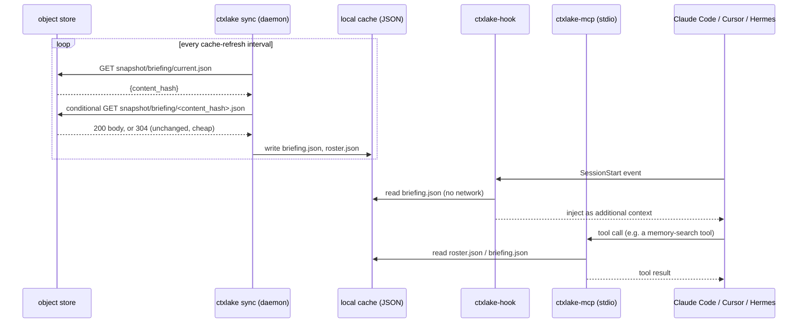
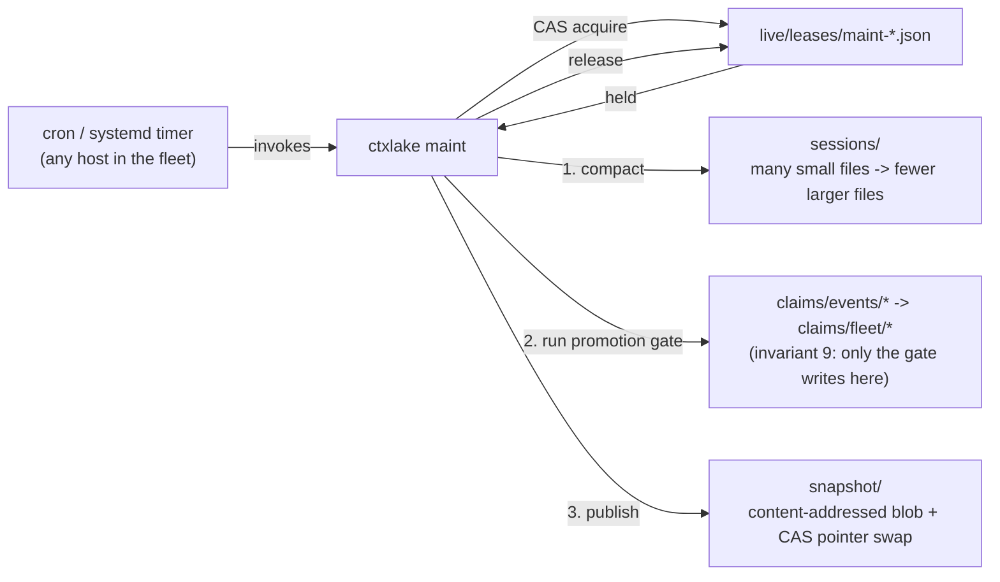

# Architecture — the operator's map

This page is written for the moment something is wrong at 2am and you need to know
which process to look at, which file to read, and why the system is shaped the way it
is before you change anything. It is not a concept overview — that's
[concepts.md](concepts.md). This is the map.

## Component inventory

Every process that touches ctxlake data, what it reads, and what it writes:

| Component | What it is | Reads | Writes | Network? |
|---|---|---|---|---|
| `ctxlake-hook` | A binary invoked once per hook event by the runtime (Claude Code, Cursor, Hermes). Exits after one event. | The event payload on stdin; the local **cache** (for injection); the redactor's static tables | The local **spool** (append one NDJSON line) | **Never.** A hook that opens a socket is a bug — invariant 1. |
| `ctxlake sync` | The daemon. Long-running, one per host, started by `ctxlake install` or run under a supervisor as `ctxlake sync --foreground`. Referred to as **ctxlake-sync** in this doc for what it *does* — it is the `sync` subcommand of the `ctxlake` binary, not a separate crate. | The local **spool**; the object **store** | The object **store** (bronze appends, `live/` CAS updates); the local **cache** | Yes — it is the only process on this list that is. |
| `ctxlake maint` | A subcommand run periodically (cron, systemd timer, or manually). Compacts small Parquet files, runs the claims promotion gate, publishes `snapshot/`. | `sessions/`, `claims/events/`, `live/leases/` | `sessions/` (compacted files), `claims/fleet/`, `snapshot/` | Yes. |
| `ctxlake-mcp` | The MCP tool server, run as `ctxlake mcp`, a **stdio child process** spawned directly by the coding agent (Claude Code / Cursor's MCP client). One instance per session. | The local **cache** only | Local **spool** (for `memory_propose` and similar write-shaped tool calls — never `live/` or `claims/fleet/` directly) | Never — same discipline as the hook, for the same reason: it's on a path the agent is waiting on. |
| Local **spool** | `~/.local/share/ctxlake/spool/<fleet_id>/<agent_id>/<session_id>.ndjson` | — | Appended to by `ctxlake-hook` and `ctxlake-mcp`; drained by `ctxlake sync` | n/a |
| Local **cache** | `~/.local/share/ctxlake/cache/<fleet_id>/{briefing,roster,leases}.json` | — | Refreshed by `ctxlake sync`'s store→cache leg; read by `ctxlake-hook` and `ctxlake-mcp` | n/a |
| `live/` | Bucket prefix, control plane | Everyone (roster/lease checks) | `ctxlake sync` (CAS, on behalf of its own host's agent) | — |
| `sessions/`, `claims/events/` | Bucket prefix, data plane | `ctxlake maint`, any query engine | `ctxlake sync` (single-writer append, one writer per key) | — |
| `snapshot/` | Bucket prefix, serving plane | Every `ctxlake sync` (store→cache leg) | `ctxlake maint` only | — |
| `claims/fleet/` | Bucket prefix | Every `ctxlake sync` (store→cache leg) | `ctxlake maint`'s promotion gate **only** — invariant 9 | — |

The load-bearing line in that table is invariant 1, restated as a boundary: **the hook
and the MCP server never touch the network.** Both talk exclusively to local files.
Everything that touches the object store is either `ctxlake sync` or `ctxlake maint` —
two processes an operator can restart, kill, or strace independently of whether an
agent is mid-turn.

## Write path

```mermaid
sequenceDiagram
    participant Agent as Claude Code / Cursor / Hermes
    participant Hook as ctxlake-hook
    participant Spool as local spool (NDJSON)
    participant Sync as ctxlake sync (daemon)
    participant Store as object store

    Agent->>Hook: PostToolUse event (JSON on stdin)
    Hook->>Hook: normalize into Envelope, run Redactor::scrub
    Hook->>Spool: append one NDJSON line
    Hook-->>Agent: exit 0 (<5ms p99, no network)
    loop every poll interval
        Sync->>Spool: tail new lines
        Sync->>Sync: batch; encode Parquet row group or build a live/ patch
        Sync->>Store: PUT sessions/... (append) or CAS PUT live/...
        Store-->>Sync: 200 OK, or 412 Precondition Failed (CAS lost, retry)
        Sync->>Spool: truncate/rotate only the lines just confirmed written
    end
```

The spool is the durability boundary. A line is never removed from it until the
corresponding store write has been *confirmed*, not merely attempted — a daemon crash
mid-batch just means the same lines get retried on restart. This is also exactly why
"spool growing" (see the failure table below) is diagnosed by asking what's stopping
confirmation, not by assuming the daemon is broken.

## Read path



Whatever an agent sees is only ever as fresh as the last completed cache refresh — see
"what ctxlake does not guarantee" below. There is no read path that waits on the
network, by the same invariant that governs writes.

## Maintenance chain



`ctxlake maint` acquires a lease on itself before doing anything, using the exact same
CAS mechanism a resource lease uses (see the state machine below) — the *maintenance
job itself* is single-writer-at-a-time, which matters because more than one host in a
fleet may have a cron entry for it. Without this, two maint processes racing to compact
the same session files, or to publish two different briefings concurrently, would be
the one place this whole design's "no cross-key atomicity" rule actually bites: a
compaction and a publish both touch multiple keys, so they need to not be happening
twice at once rather than being made atomic.

## Lease state machine

```mermaid
stateDiagram-v2
    [*] --> Free: lazily created on first claim\n(unconditional PUT, not put-if-absent — storage.md)
    Free --> Held: CAS PutMode::Update(version)\ncontents: {status: held, owner, expires_at}
    Held --> Held: renew before expiry\nCAS from the version last read
    Held --> Free: explicit release\nCAS write back to free
    Held --> Expired: now (store's Date header) > expires_at
    Expired --> Held: any agent may CAS-acquire\n(advisory — no fencing check on the old holder)
```

Every arrow *after* bootstrap is the same primitive: a CAS write against a version you
just read. The `[*] --> Free` arrow is the one exception — an unconditional `PUT`, not
a CAS write, because there is nothing yet to hold a version to compare against (see
[storage.md](storage.md) for why that's still safe). Past that first write, there is no
separate "lock" API — a lease is just a JSON object whose contents happen to mean
something, and the whole reason the rest of the machine can be reasoned about this
simply is that acquisition, renewal, and release never use put-if-absent (storage.md)
or a local clock (invariant 6).

## Where does my data actually go — a worked trace

You run an `Edit` on `crates/foo/src/lib.rs` in a Claude Code session. Fleet is
`myteam`, your agent id is `cc-01`, the store is `s3://my-bucket/ctxlake`.

1. Claude Code finishes the edit and fires its `PostToolUse` hook — the entry
   `ctxlake install` merged into `.claude/settings.json` runs `ctxlake-hook` with the
   tool-call JSON on stdin.
2. `ctxlake-hook` ([`main.rs`](../crates/ctxlake-hook/src/main.rs)) builds one
   [`Envelope`](../crates/ctxlake-core/src/envelope.rs): `event_type: ToolCall`,
   `tool.name: "Edit"`, `tool.paths: ["crates/foo/src/lib.rs"]`, and a `content_hash`
   via [`hash::content_hash`](../crates/ctxlake-core/src/hash.rs).
3. Before anything touches disk, [`Redactor::scrub`](../crates/ctxlake-core/src/redact.rs)
   runs over the tool input and result. This edit is clean, so the content passes
   through unchanged — a secret here would instead be quarantined and never reach step 4.
4. The hook writes one line — `Envelope::to_ndjson()`, no embedded newline, guaranteed
   by the envelope's own tests — appended to
   `~/.local/share/ctxlake/spool/myteam/cc-01/<session_id>.ndjson`, then exits. Total
   time: under the 5ms budget. No socket was opened.
5. `ctxlake sync`, already running on your laptop, tails that file on its poll
   interval. The session hasn't ended, so it buffers rather than sealing early.
6. `SessionEnd` fires the same hook path with one final envelope. On its next poll,
   `ctxlake sync` seals the batch — encodes it as one Parquet row group and does a
   single-writer append PUT to
   `s3://my-bucket/ctxlake/sessions/runtime=claude_code/agent=cc-01/date=2026-09-11/<session_id>.parquet`.
   No CAS here: this key is only ever written by `cc-01`'s own daemon.
7. Because the edit touched a real path, the daemon also updates `cc-01`'s own roster
   entry at `s3://my-bucket/ctxlake/live/agents/cc-01.json` — a
   `PutMode::Update(version)` CAS write reflecting the last-active path.
8. Later, `ctxlake maint` runs on some host in the fleet, wins the maintenance lease,
   compacts small session files, runs the promotion gate over `claims/events/`, and
   republishes the briefing: a new blob at
   `snapshot/briefing/<content-hash>.json`, then a CAS swap of
   `snapshot/briefing/current.json` to point at it.
9. Back on your laptop, `ctxlake sync`'s store→cache leg notices the pointer changed
   (a conditional GET against `current.json`), fetches the new blob, and writes it to
   `~/.local/share/ctxlake/cache/myteam/briefing.json`.
10. Next time anyone in `myteam` starts a session, `ctxlake-hook`'s `SessionStart`
    handler reads that exact file — never the store — and injects it as additional
    context.

Your keystroke reached Parquet, and came back out as a teammate's briefing, without
either agent's hook process ever making a network call.

## Failure modes

| Symptom | First thing to check | Why |
|---|---|---|
| Empty briefing at session start | Is `ctxlake sync` running (`ctxlake status`)? Then check the mtime of `~/.local/share/ctxlake/cache/<fleet>/briefing.json` | The hook only ever reads the local cache. If the daemon isn't running or hasn't completed a first refresh yet, the file may not exist — the hook fails *open* (no briefing) rather than blocking the session. |
| Peers show up as invisible / roster looks empty | Confirm your own `live/agents/<agent_id>.json` exists and hasn't passed `expires_at`; check the cache's roster refresh timestamp | Presence is inferred from CAS objects under `live/agents/`, mirrored into the local cache on a poll cycle. A peer whose heartbeat hasn't renewed within its TTL is legitimately gone — and a stale local cache produces the identical symptom for a peer that's actually still there. |
| Local spool keeps growing | `ctxlake status` for the daemon; `ctxlake doctor` for store connectivity; spool directory size | A spool line is only removed after its store write is *confirmed*. A crashed daemon, a network partition, or a store outage all present as unbounded spool growth, because deleting unacknowledged data would break the one durability guarantee this design has. |
| Hook adds noticeable latency to a tool call | Manually time `ctxlake-hook` against a captured payload; check whether the tool's output is unusually large | Budget is 5ms p99, and a hook that opens a socket is a bug (invariant 1). Slowness is almost always a huge tool-output payload interacting with `MAX_SCAN_BYTES`, a full local disk making the spool append block, or — as an actual bug — network I/O that snuck into the hook path. |
| `412 Precondition Failed` storms in the sync log | Are the failures concentrated on one key, or spread across many? | A 412 is CAS working as designed, not an error — the daemon retries with backoff. Failures concentrated on one key point at a genuinely hot object (see [scaling.md](scaling.md)); failures spread across many keys point at clock skew or a retry loop missing its backoff. |
| Claims never promote to fleet scope | Is `ctxlake maint` actually scheduled and running? Did it win the maintenance lease? Compare `claims/events/` (pending) against `claims/fleet/` (promoted) | Promotion is invariant 9 — only the gate, inside `ctxlake maint`, ever writes `claims/fleet/`. A missing cron entry, a maint process losing the lease race, and a genuinely unmet promotion rule (independence gate, an unresolved contradiction) all look identical from outside. Check the maint log before assuming a bug. |
| Two agents edited the same file | This is a git problem, not a ctxlake problem | Leases are advisory (invariant 5) — ctxlake can warn, it cannot revoke a running agent's ability to write to disk. Git is the declared arbiter for code. A warning that was ignored, or that arrived late because of the poll interval's staleness window, is expected behavior. |
| `ctxlake doctor` reports a backend failing CAS | Which primitive failed — put-if-absent or `If-Match`/`ifGenerationMatch` — and against which backend | Backends genuinely differ (storage.md). MinIO rejecting `If-None-Match: *` is permanent vendor behavior, not a transient fault — `doctor` exists so you learn this before deploying, not mid-incident. |
| `quarantine/` growing fast | Which `rules_fired` values dominate in recent entries | A flood of one rule (commonly `high_entropy_run`) usually means a false-positive source — a build emitting long hashes or minified output — not an actual leak. Look before tightening or loosening the redactor. |

## Every knob, its default, and its blast radius

| Knob | Default | Blast radius |
|---|---|---|
| Hook budget | 5ms p99 (design target, not a runtime setting) | Exceeding it makes every single tool call feel laggy — this is the number invariant 1 exists to protect. |
| `MAX_SCAN_BYTES` ([`redact.rs`](../crates/ctxlake-core/src/redact.rs)) | 256 KiB | Entropy scanning only covers the first 256 KiB of a field. Literal marker matching still covers the whole field, but a secret positioned past the cutoff in an oversized tool-output blob, with no literal prefix, will not be caught by entropy alone. |
| `ENTROPY_MIN_LEN` / `ENTROPY_THRESHOLD` (redact.rs) | 32 chars / 4.5 bits/char | Too low a threshold false-positives on ordinary long identifiers (git SHAs and ULIDs sit near entropy 4.0 and are meant to survive — see the redactor's own test suite); too high misses real base64/hex secrets, which sit near 6.0. |
| Lease TTL | 5 minutes | Too short: an actively-working agent can appear expired after a scheduling hiccup, and get "acquired out from under it" (advisory, so this is a false-warning cost, not data loss). Too long: a genuinely crashed agent's lease looks held for longer than useful. |
| Lease renewal interval | 60s (1/5 of TTL) | The 5:1 ratio is a standard safety margin — one missed renewal cycle doesn't expire the lease. Renewing more often directly costs money: PUTs price at 12.5x a GET (scaling.md). |
| Roster/live poll interval | 5s | Lower = fresher peer visibility, at O(N) to O(N²) request cost depending on discovery strategy (scaling.md). Higher = the "peers invisible" symptom above becomes more likely for a peer that just joined. |
| Cache refresh interval (store→cache leg) | 5–15s | This is the staleness floor for everything an agent's hook or MCP tools ever see — briefing, roster, leases. Nothing waits for a fresher read, by invariant 1, so this number *is* the freshness guarantee. |
| Spool flush / batch trigger | time- or size-based (e.g. 2s or N events) | Larger batches mean fewer, larger store writes (cheaper, per scaling.md's small-object-explosion section) at the cost of a bigger window of unconfirmed data sitting only in the local spool if the daemon crashes. |
| Maintenance schedule (`ctxlake maint`) | operator-configured cron/systemd timer | Too infrequent: claims sit unpromoted, briefings go stale, small files accumulate. Too frequent: maintenance-lease contention across hosts, and more LIST/PUT traffic for no benefit once a run finds nothing new to do. |
| `doctor` probe object lifecycle | written under a scratch prefix, deleted on success | A `doctor` run that crashes mid-probe can leave litter behind; a bucket lifecycle rule on the scratch prefix is cheap insurance, not required for correctness. |
| Agent id stability | operator-assigned, must be stable across restarts | Reusing the same `agent_id` from two different physical hosts makes them share one roster entry and one lease identity — CAS still prevents lost writes, but the human-facing "who is doing what" picture becomes wrong. |

## What ctxlake does NOT guarantee

Say these plainly, here, not in a footnote:

- **Leases are advisory, and the fencing-token limit is real.** No backend here can
  reject a write from a process whose lease already expired — a stalled agent can wake
  up and write anyway. For code, git is the arbiter. For an irreversible external
  action, the target system needs its own idempotency key; ctxlake cannot supply one.
- **Snapshots are stale by construction.** A briefing or roster view is only as fresh
  as the last completed cache refresh on your host. Under a network partition or a
  dead daemon, that can be minutes old, and nothing blocks work to wait for freshness —
  that would violate invariant 1.
- **There is no cross-key atomicity.** A snapshot publish is two writes (blob, then
  pointer) — a crash between them leaves an orphaned blob (harmless) or simply means
  the pointer swap never happens (also harmless: readers keep seeing the old snapshot).
  But a claim's proposal and its later promotion are two separate keys with no
  transaction linking them, and nothing in this design changes that.
- **Redaction has edges.** `MAX_SCAN_BYTES` caps entropy scanning at 256 KiB per field;
  a compromised host with valid store credentials can always write around the hook
  entirely, since redaction only protects data that actually flows through it.
- **There is an honest ceiling of roughly 50 concurrently active agents.** Past that,
  CAS contention and O(N) request volume against `live/` make plain object storage
  impractical at the polling intervals this design assumes — see the arithmetic in
  [scaling.md](scaling.md). The documented path past that ceiling is moving `live/` to
  DynamoDB or Redis while `sessions/` and `snapshot/` stay exactly as they are; ctxlake
  does not do this automatically.

## Next steps

- [scaling.md](scaling.md) — the cost arithmetic behind the poll-interval and TTL
  defaults above, and the ~50-agent ceiling
- [storage.md](storage.md) — the CAS capability matrix the lease state machine depends on
- [security.md](security.md) — redaction, quarantine, and the IAM policy shape
- [coordination.md](coordination.md) — roster, intents, and leases from the user's side
