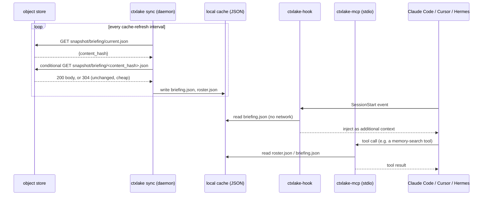
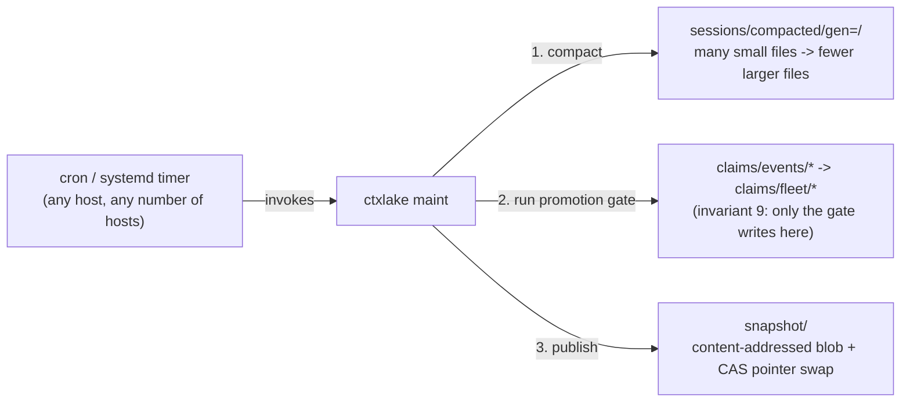

# Architecture — the operator's map

This page is written for the moment something is wrong at 2am and you need to know
which process to look at, which file to read, and why the system is shaped the way it
is before you change anything. It is not a concept overview — that's
[concepts.md](concepts.md). This is the map.

## Component inventory

Every process that touches ctxlake data, what it reads, and what it writes:

| Component | What it is | Reads | Writes | Network? |
|---|---|---|---|---|
| `ctxlake-hook` | A binary invoked once per hook event by the runtime (Claude Code, Cursor, Hermes). Exits after one event. | The event payload on stdin; the local **cache** (for injection) | The local **spool** (append one NDJSON line) | **Never.** A hook that opens a socket is a bug — invariant 1. |
| `ctxlake sync` | The daemon. Long-running, one per host, started by `ctxlake install` or run under a supervisor as `ctxlake sync --foreground`. | The local **spool**; the object **store** | The object **store** (bronze appends, `live/` CAS updates); the local **cache** | Yes — the only process on this list that is. |
| `ctxlake maint` | A subcommand run periodically (cron, systemd timer, or manually). Compacts small Parquet files, runs the claims promotion gate, publishes `snapshot/`. Safe to run from every host at once — see [coordination.md](coordination.md). | `sessions/`, `claims/events/` | `sessions/` (compacted files), `claims/fleet/`, `snapshot/` | Yes. |
| `ctxlake-mcp` | The MCP tool server, run as `ctxlake mcp`, a **stdio child process** spawned by the coding agent. One instance per session. | The local **cache** only | Local **spool** (for `memory_propose` and similar write-shaped tool calls) | Never — same discipline as the hook, for the same reason. |
| Local **spool** | `~/.ctxlake/spool/<runtime>/<session_id>.ndjson` | — | Appended to by `ctxlake-hook` and `ctxlake-mcp`; drained by `ctxlake sync` | n/a |
| Local **cache** | `~/.ctxlake/cache/<fleet_id>/{briefing,roster}.json` | — | Refreshed by `ctxlake sync`'s store→cache leg; read by `ctxlake-hook` and `ctxlake-mcp` | n/a |
| `live/` | Bucket prefix, control plane | Everyone (roster checks) | `ctxlake sync` (CAS, on behalf of its own host's agent) | — |
| `sessions/`, `claims/events/` | Bucket prefix, data plane | `ctxlake maint`, any query engine | `ctxlake sync` (single-writer append, one writer per key) | — |
| `snapshot/` | Bucket prefix, serving plane | Every `ctxlake sync` (store→cache leg) | `ctxlake maint` only | — |
| `claims/fleet/` | Bucket prefix | Every `ctxlake sync` (store→cache leg) | `ctxlake maint`'s promotion gate **only** — invariant 9 | — |

> **The spool is partitioned by runtime, not by fleet or agent.** A hook knows its own
> runtime with certainty; `fleet_id` and `agent_id` come from the environment and may be
> unset, and a path built from an unset value is a path you cannot find later. Every
> envelope carries both fields anyway, so the daemon reads them from the content rather
> than the directory.

The load-bearing line in that table is invariant 1, restated as a boundary: **the hook
and the MCP server never touch the network.** Everything that touches the object store
is either `ctxlake sync` or `ctxlake maint` — two processes an operator can restart,
kill, or strace independently of whether an agent is mid-turn.

## Write path

```mermaid
sequenceDiagram
    participant Agent as Claude Code / Cursor / Hermes
    participant Hook as ctxlake-hook
    participant Spool as local spool (NDJSON)
    participant Sync as ctxlake sync (daemon)
    participant Store as object store

    Agent->>Hook: PostToolUse event (JSON on stdin)
    Hook->>Hook: normalize into Envelope, run Redactor::scrub
    Hook->>Spool: append one NDJSON line
    Hook-->>Agent: exit 0 (<5ms p99, no network)
    loop every poll interval
        Sync->>Spool: tail new lines
        Sync->>Sync: batch; encode Parquet row group or build a live/ patch
        Sync->>Store: PUT sessions/... (append) or CAS PUT live/...
        Store-->>Sync: 200 OK, or 412 Precondition Failed (CAS lost, retry)
        Sync->>Spool: truncate/rotate only the lines just confirmed written
    end
```

The spool is the durability boundary. A line is never removed from it until the
corresponding store write has been *confirmed*, not merely attempted — a daemon crash
mid-batch just means the same lines get retried on restart.

## Read path



Whatever an agent sees is only ever as fresh as the last completed cache refresh — see
"what ctxlake does not guarantee" below. There is no read path that waits on the
network, by the same invariant that governs writes.

## Maintenance chain



Every host in a fleet can run `ctxlake maint` on its own timer, or none can, and nothing
breaks either way — there is no lock to acquire first. Compaction's output directory is
named by a hash of its input session set, so two hosts compacting the same sessions
write the same bytes to the same place; extraction claims each session with a
create-if-absent marker before working on it, so at most one host's attempt succeeds;
the snapshot publish is a content-addressed blob followed by a CAS pointer swap. See
[coordination.md](coordination.md) for why none of this needs mutual exclusion.

## Where does my data actually go — a worked trace

You run an `Edit` on `crates/foo/src/lib.rs` in a Claude Code session. Fleet is
`myteam`, your agent id is `cc-01`, the store is `s3://my-bucket/ctxlake`.

1. Claude Code fires its `PostToolUse` hook — the entry `ctxlake install` merged into
   `.claude/settings.json` runs `ctxlake-hook` with the tool-call JSON on stdin.
2. `ctxlake-hook` ([`main.rs`](../crates/ctxlake-hook/src/main.rs)) builds one
   [`Envelope`](../crates/ctxlake-core/src/envelope.rs): `event_type: ToolCall`,
   `tool.name: "Edit"`, `tool.paths: ["crates/foo/src/lib.rs"]`, and a `content_hash`.
3. [`Redactor::scrub`](../crates/ctxlake-core/src/redact.rs) runs over the tool input
   and result before anything touches disk. This edit is clean, so it passes through
   unchanged — a secret here would instead be quarantined and never reach step 4.
4. The hook appends one NDJSON line to
   `~/.ctxlake/spool/claude_code/<session_id>.ndjson`, then exits. Total time: under
   the 5ms budget. No socket was opened.
5. `ctxlake sync`, already running on your laptop, tails that file on its poll
   interval and buffers it — the session hasn't ended.
6. `SessionEnd` fires the same hook path. On its next poll, `ctxlake sync` seals the
   batch — one Parquet row group, single-writer append PUT to
   `s3://my-bucket/ctxlake/sessions/runtime=claude_code/agent=cc-01/date=2026-09-11/<session_id>.parquet`.
   No CAS here: this key is only ever written by `cc-01`'s own daemon.
7. The daemon also updates `cc-01`'s own roster entry at
   `s3://my-bucket/ctxlake/live/agents/cc-01.json` — a `PutMode::Update(version)` CAS
   write reflecting the last-active path.
8. Later, `ctxlake maint` runs on some host in the fleet: compacts small session files,
   runs the promotion gate over `claims/events/`, and republishes the briefing — a new
   blob at `snapshot/briefing/<content-hash>.json`, then a CAS swap of
   `snapshot/briefing/current.json` to point at it.
9. Back on your laptop, `ctxlake sync`'s store→cache leg notices the pointer changed
   (a conditional GET), fetches the new blob, and writes
   `~/.ctxlake/cache/<fleet_id>/briefing.json`.
10. Next session anyone in `myteam` starts, `ctxlake-hook`'s `SessionStart` handler
    reads that exact file — never the store — and injects it as additional context.

Your keystroke reached Parquet, and came back out as a teammate's briefing, without
either agent's hook process ever making a network call.

## Failure modes

| Symptom | First thing to check | Why |
|---|---|---|
| Empty briefing at session start | Is `ctxlake sync` running (`ctxlake status`)? Then check the mtime of `~/.ctxlake/cache/<fleet_id>/briefing.json` | The hook only ever reads the local cache. If the daemon isn't running or hasn't completed a first refresh yet, the file may not exist — the hook fails *open* (no briefing) rather than blocking the session. |
| Peers show up as invisible / roster looks empty | Confirm your own `live/agents/<agent_id>.json` exists and hasn't passed `expires_at`; check the cache's roster refresh timestamp | A peer whose heartbeat hasn't renewed is legitimately gone — a stale local cache produces the identical symptom for a peer that's actually still there. |
| Local spool keeps growing | `ctxlake status` for the daemon; `ctxlake doctor` for store connectivity; spool directory size | A spool line is only removed after its store write is *confirmed*. A crashed daemon, a network partition, or a store outage all present as unbounded spool growth. |
| Hook adds noticeable latency to a tool call | Manually time `ctxlake-hook` against a captured payload; check whether the tool's output is unusually large | Budget is 5ms p99. Slowness is almost always a huge tool-output payload interacting with `MAX_SCAN_BYTES`, a full local disk, or — as an actual bug — network I/O that snuck into the hook path. |
| `412 Precondition Failed` storms in the sync log | Are the failures concentrated on one key, or spread across many? | A 412 is CAS working as designed — the daemon retries with backoff. Concentrated on one key points at a genuinely hot object ([scaling.md](scaling.md)); spread across many points at clock skew or a retry loop missing its backoff. |
| Claims never promote to fleet scope | Is `ctxlake maint` actually scheduled and running? Compare `claims/events/` (pending) against `claims/fleet/` (promoted) | Only the gate, inside `ctxlake maint`, ever writes `claims/fleet/` (invariant 9). A missing cron entry and a genuinely unmet promotion rule (independence gate, an unresolved contradiction) look identical from outside — check the maint log before assuming a bug. |
| `ctxlake doctor` reports a backend failing CAS | Which primitive failed — put-if-absent or `If-Match`/`ifGenerationMatch` — and against which backend | Backends genuinely differ ([storage.md](storage.md)). MinIO rejecting `If-None-Match: *` is permanent vendor behavior, not a transient fault. |
| `quarantine/` growing fast | Which `rules_fired` values dominate in recent entries | A flood of one rule (commonly `high_entropy_run`) usually means a false-positive source — a build emitting long hashes or minified output — not an actual leak. |

## Every knob, its default, and its blast radius

| Knob | Default | Blast radius |
|---|---|---|
| Hook budget | 5ms p99 (design target, not a runtime setting) | Exceeding it makes every tool call feel laggy. |
| `MAX_SCAN_BYTES` ([`redact.rs`](../crates/ctxlake-core/src/redact.rs)) | 256 KiB | Entropy scanning only covers the first 256 KiB of a field. A secret positioned past the cutoff, with no literal prefix, will not be caught by entropy alone. |
| `ENTROPY_MIN_LEN` / `ENTROPY_THRESHOLD` (redact.rs) | 32 chars / 4.5 bits/char | Too low false-positives on ordinary long identifiers (git SHAs, ULIDs); too high misses real base64/hex secrets. |
| Roster heartbeat TTL | 5 minutes | How long a peer with no fresh heartbeat still shows as active. Too short: a working agent can look gone after a scheduling hiccup. Too long: a crashed agent lingers on the roster. |
| Roster heartbeat renewal interval | 60s (1/5 of TTL) | The 5:1 ratio means one missed renewal cycle doesn't drop a live peer. Renewing more often directly costs money: PUTs price at 12.5x a GET ([scaling.md](scaling.md)). |
| Roster/live poll interval | 5s | Lower = fresher peer visibility, at O(N)–O(N²) request cost depending on discovery strategy ([scaling.md](scaling.md)). Higher = a peer that just joined stays invisible longer. |
| Cache refresh interval (store→cache leg) | 5–15s | The staleness floor for everything an agent's hook or MCP tools ever see. Nothing waits for a fresher read, so this number *is* the freshness guarantee. |
| Spool flush / batch trigger | time- or size-based (e.g. 2s or N events) | Larger batches mean fewer, larger store writes at the cost of more unconfirmed data sitting in the local spool if the daemon crashes. |
| Maintenance schedule (`ctxlake maint`) | operator-configured cron/systemd timer | Too infrequent: claims sit unpromoted, briefings go stale, small files accumulate. Too frequent: more LIST/PUT traffic once a run finds nothing new to do — never contention, since runs don't coordinate. |
| Agent id stability | operator-assigned, must be stable across restarts | Reusing one `agent_id` from two different hosts makes them share a roster entry — CAS still prevents lost writes, but "who is doing what" becomes wrong. |

## What ctxlake does NOT guarantee

- **Snapshots are stale by construction.** A briefing or roster view is only as fresh
  as the last completed cache refresh on your host. Under a network partition or a
  dead daemon, that can be minutes old, and nothing blocks work to wait for freshness.
- **There is no cross-key atomicity.** A snapshot publish is two writes (blob, then
  pointer) — a crash between them leaves an orphaned blob (harmless) or means the
  pointer swap never happens (also harmless). A claim's proposal and its later
  promotion are two separate keys with no transaction linking them.
- **Idempotent is not free.** Two hosts racing to compact or extract the same input
  produce the same result, but the loser's work was still spent — wasted cost, not
  corrupted output.
- **Redaction has edges.** `MAX_SCAN_BYTES` caps entropy scanning at 256 KiB per field;
  a compromised host with valid store credentials can always write around the hook
  entirely.
- **There is an honest ceiling of roughly 50 concurrently active agents.** Past that,
  CAS contention and O(N) request volume against `live/` make plain object storage
  impractical at the polling intervals this design assumes — see
  [scaling.md](scaling.md). The documented path past that ceiling is moving `live/` to
  DynamoDB or Redis while `sessions/` and `snapshot/` stay exactly as they are.

## Next steps

- [scaling.md](scaling.md) — the cost arithmetic behind the poll-interval defaults
  above, and the ~50-agent ceiling
- [storage.md](storage.md) — the CAS capability matrix this all depends on
- [security.md](security.md) — redaction, quarantine, and the IAM policy shape
- [coordination.md](coordination.md) — roster and intents from the user's side
