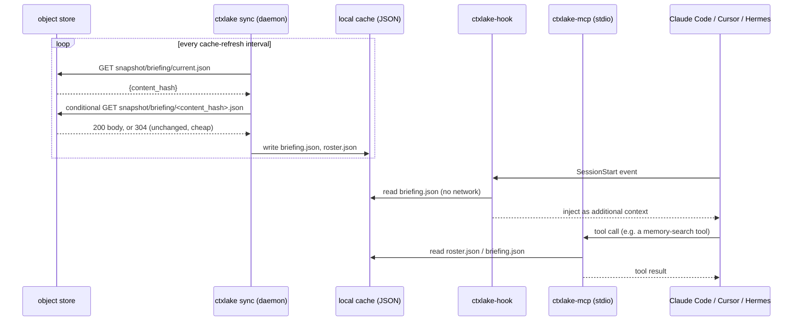
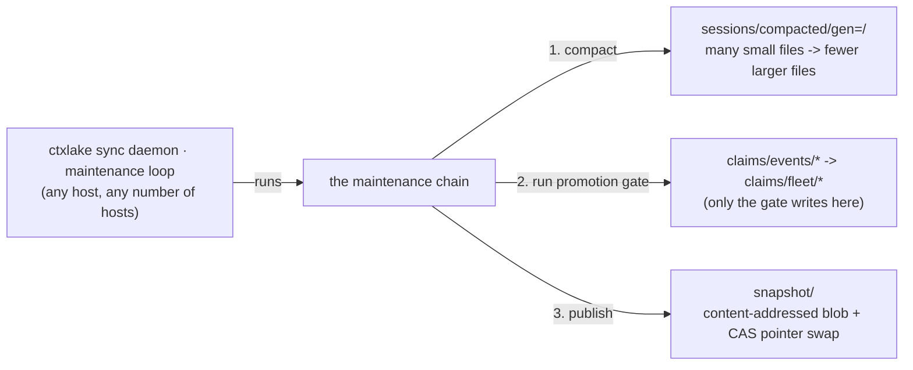

# Architecture — the operator's map

For the moment something is wrong at 2am and you need to know which process to look at
and which file to read. [How it works](how-it-works.md) is the concept overview; this
is the map.

## Component inventory

| Component | What it is | Reads | Writes | Network? |
|---|---|---|---|---|
| `ctxlake-hook` | A binary invoked once per hook event, exits after one event | The payload on stdin; the local **cache** | The local **spool** (one NDJSON line) | **Never** |
| `ctxlake sync` | The daemon. Long-running, one per host | The local **spool**; the object **store** | The **store** (bronze appends, `live/` CAS); the local **cache** | Yes |
| `ctxlake maint` | The same chain the daemon runs every 5 min; the subcommand forces a cycle now | `sessions/`, `claims/events/` | `sessions/compacted/`, `claims/fleet/`, `snapshot/` | Yes |
| `ctxlake-mcp` | The MCP tool server, a stdio child of the agent, one per session | The local **cache** only | The local **spool** | Never |

**The hook and the MCP server never touch the network.** Everything that touches the
object store is `ctxlake sync` or `ctxlake maint` — two processes an operator can
restart, kill or strace independently of whether an agent is mid-turn.

> **The spool is partitioned by runtime, not by fleet or agent.** A hook knows its own
> runtime with certainty; `fleet_id` and `agent_id` come from the environment and may be
> unset, and a path built from an unset value is a path you cannot find later. Every
> envelope carries both fields anyway, so the daemon reads them from the content.

## Write path

```mermaid
sequenceDiagram
    participant Agent as Claude Code / Cursor / Hermes
    participant Hook as ctxlake-hook
    participant Spool as local spool (NDJSON)
    participant Sync as ctxlake sync (daemon)
    participant Store as object store

    Agent->>Hook: PostToolUse event (JSON on stdin)
    Hook->>Hook: normalize into Envelope, run Redactor::scrub
    Hook->>Spool: append one NDJSON line
    Hook-->>Agent: exit 0 (<5ms p99, no network)
    loop every poll interval
        Sync->>Spool: tail new lines
        Sync->>Sync: batch; encode Parquet row group or build a live/ patch
        Sync->>Store: PUT sessions/... (append) or CAS PUT live/...
        Store-->>Sync: 200 OK, or 412 Precondition Failed (CAS lost, retry)
        Sync->>Spool: truncate/rotate only the lines just confirmed written
    end
```

The spool is the durability boundary: a line is never removed until its store write is
*confirmed*, so a daemon crash mid-batch just means those lines are retried on restart.

## Read path



What an agent sees is only ever as fresh as the last completed cache refresh. No read path
waits on the network.

## Maintenance chain



The sync daemon runs this every 5 minutes, and `ctxlake maint` runs it by hand. Any
number of hosts can do either at once, and none has to. There is no lock to acquire — see
[How it works](how-it-works.md).

## A worked trace

You run an `Edit` on `crates/foo/src/lib.rs` in a Claude Code session (fleet `myteam`,
agent `cc-01`, store `s3://my-bucket/ctxlake`):

1. `PostToolUse` fires the entry `ctxlake install` merged into `.claude/settings.json`,
   running `ctxlake-hook` with the tool-call JSON on stdin.
2. The hook builds one `Envelope` — `event_type: ToolCall`, `tool.name: "Edit"`,
   `tool.paths: [...]`, a `content_hash` — and `Redactor::scrub` runs before anything
   touches disk. A secret here would be quarantined and never reach step 3.
3. One NDJSON line is appended to `~/.ctxlake/spool/claude_code/<session_id>.ndjson`.
   Under the 5ms budget. No socket opened.
4. `ctxlake sync` tails that file and buffers until `SessionEnd`, then seals the batch
   into one Parquet row group under `sessions/…/session=<id>/`. No CAS: only `cc-01`'s
   own daemon ever writes that key. It also CAS-updates `live/agents/cc-01.json`.
5. Later, `ctxlake maint` on some host compacts, runs the promotion gate, and republishes
   the briefing — a new content-addressed blob, then a CAS swap of the pointer.
6. Your daemon's store→cache leg notices the pointer changed via a conditional GET and
   writes `~/.ctxlake/cache/myteam/briefing.json`. The next session anyone in `myteam`
   starts reads that exact file — never the store — and injects it as context.

Your keystroke reached Parquet and came back out as a teammate's briefing without either
agent's hook process making a network call.

## Where state actually lives

Almost every question reduces to one of these. Nothing else is authoritative.

| What | Where | Read it when |
|---|---|---|
| Config | `~/.config/ctxlake/ctxlake.toml` | attribution is wrong, or the wrong store is in use |
| Spool | `~/.ctxlake/spool/<runtime>/<session_id>.ndjson` | asking "was this event captured at all" |
| Cache | `~/.ctxlake/cache/<fleet_id>/{briefing,roster}.json` | the briefing is empty, stale, or missing peers |
| Hook errors | `~/.ctxlake/hook-errors.log` | a hook is misbehaving but the session looks fine |

> **The hook never fails a turn.** On any internal error it still emits a valid response
> and exits zero, because a capture tool that can break your agent is worse than one that
> occasionally misses an event. Hook failures are therefore *silent by design*, and that
> log is where they go.

The spool is newline-delimited JSON, one envelope per line, written post-redaction — the
ground truth for "did capture happen":

```sh
wc -l ~/.ctxlake/spool/*/*.ndjson                                  # anything captured at all?
jq -r .event_type ~/.ctxlake/spool/claude_code/<id>.ndjson | sort | uniq -c
jq -r 'select(.redaction.status != "clean") | .redaction.rules_fired | join(",")' \
  ~/.ctxlake/spool/*/*.ndjson | sort | uniq -c                     # did redaction fire, on what?
jq -r 'select(.tool) | "\(.tool.name)\t\(.tool.exit_code)"' \
  ~/.ctxlake/spool/*/*.ndjson | head                               # exit codes present?
```

Two things only the spool tells you: a growing spool with a reachable store means the
daemon is not draining it (capture is still safe, nothing is lost), and `fleet_id` or
`agent_id` reading `unconfigured-*` means the hook ran without its environment set —
capture works, attribution does not; re-run the installer.

The lake is plain partitioned Parquet, so you can check it without trusting ctxlake's own
code:

```sh
duckdb -c "SELECT runtime, event_type, count(*) FROM 's3://bucket/ctxlake/sessions/**/*.parquet' GROUP BY 1,2"
```

## Failure modes

| Symptom | First thing to check | Why |
|---|---|---|
| Empty briefing at session start | `ctxlake sync status`, then the mtime of `cache/<fleet_id>/briefing.json` | The hook only reads the local cache. Without a daemon the file may not exist — the hook fails *open* rather than blocking the session |
| Everything worked until a reboot | `ctxlake sync status` — is a service installed, and on Linux is lingering on? | An un-supervised daemon does not come back. Capture keeps working (the hook writes locally), so the only symptom is a briefing going stale |
| Service `active` but no pidfile | the daemon log in `~/.ctxlake/run/` | It is crash-looping faster than it can write one. Exit 78 means the config is missing or unusable, and systemd will have stopped retrying |
| Peers invisible / roster empty | That your own `live/agents/<id>.json` exists and has not passed `expires_at`; the cache's refresh timestamp | A peer whose heartbeat lapsed is legitimately gone — a stale local cache looks identical for a peer that is still there |
| Local spool keeps growing | `ctxlake status` for the daemon, `ctxlake doctor` for connectivity | A line is removed only after its write is confirmed. A crashed daemon, a partition, and a store outage all present this way |
| Hook adds noticeable latency | Time `ctxlake-hook` against a captured payload; check for an unusually large tool output | Budget is 5ms p99. Almost always a huge payload meeting `MAX_SCAN_BYTES`, a full disk, or — as a real bug — network I/O in the hook path |
| `412 Precondition Failed` storms | Whether failures concentrate on one key or spread across many | A 412 is CAS working. Concentrated means a genuinely hot object; spread means clock skew or a retry loop missing its backoff |
| Claims never promote | `ctxlake sync status`, then compare `claims/events/` against `claims/fleet/` | Only the gate writes `claims/fleet/`. A daemon that is not running and an unmet promotion rule look identical from outside |
| `doctor` reports a backend failing CAS | Which primitive failed, against which backend | Backends genuinely differ ([Storage](storage.md)). MinIO rejecting `If-None-Match: *` is permanent vendor behaviour, not a transient fault |
| `quarantine/` growing fast | Which `rules_fired` values dominate | A flood of one rule (commonly `high_entropy_run`) usually means a false-positive source — a build emitting long hashes — not a leak |

## Resetting safely

Ordered least to most destructive; stop at the first that helps.

1. **Let the cache rebuild.** Delete `~/.ctxlake/cache/` — it is derived and the daemon
   refetches. Fixes most briefing weirdness and cannot lose anything.
2. **Reinstall the hooks.** Idempotent, writes a `.bak`, uninstall is exact.
3. **Do not delete the spool** unless you accept losing those sessions. It is the only
   copy of anything not yet uploaded.

Nothing here touches the lake, and no troubleshooting step should ever be a reason to
write to it.

## Every knob, its default, and its blast radius

| Knob | Default | Blast radius |
|---|---|---|
| Hook budget | 5ms p99 (design target, not a setting) | Exceeding it makes every tool call feel laggy |
| `MAX_SCAN_BYTES` | 256 KiB | Entropy scanning covers only the first 256 KiB of a field. A secret past the cutoff with no literal prefix is not caught by entropy alone |
| `ENTROPY_MIN_LEN` / `ENTROPY_THRESHOLD` | 32 chars / 4.5 bits per char | Too low false-positives on git SHAs and ULIDs; too high misses real base64/hex secrets |
| Roster heartbeat TTL | 5 minutes | How long a peer with no fresh heartbeat still shows as active |
| Heartbeat renewal interval | 60s (1/5 of TTL) | The 5:1 ratio means one missed cycle does not drop a live peer. Renewing more often costs money: PUTs are 12.5x a GET |
| Roster/live poll interval | 5s | Lower = fresher peers at `O(N)`–`O(N²)` request cost ([Storage](storage.md)). Higher = a new peer stays invisible longer |
| Cache refresh interval | 5–15s | The staleness floor for everything an agent ever sees. Nothing waits for a fresher read, so this number *is* the freshness guarantee |
| Spool flush / batch trigger | time- or size-based (e.g. 2s or N events) | Larger batches mean fewer, larger writes, at the cost of more unconfirmed data in the spool if the daemon crashes |
| Maintenance schedule | every 5 min, in the sync daemon | Too infrequent: stale briefings, unpromoted claims, small files. Too frequent: more LIST/PUT traffic finding nothing to do — never contention |
| Agent id stability | operator-assigned | Reusing one `agent_id` from two hosts makes them share a roster entry. CAS still prevents lost writes, but "who is doing what" becomes wrong |

## What ctxlake does NOT guarantee

- **Snapshots are stale by construction.** A briefing or roster view is only as fresh as
  the last completed cache refresh on your host. Under a partition or a dead daemon that
  can be minutes old, and nothing blocks work to wait for freshness.
- **There is no cross-key atomicity.** A snapshot publish is two writes; a crash between
  them leaves an orphaned blob (harmless) or no pointer swap (also harmless). A claim's
  proposal and its promotion are two keys with no transaction linking them.
- **Idempotent is not free.** Two hosts racing to compact or extract the same input
  produce the same result, but the loser's work was still spent — wasted cost, not
  corrupted output.
- **Redaction has edges.** `MAX_SCAN_BYTES` caps entropy scanning at 256 KiB per field,
  and a compromised host with valid store credentials can write around the hook entirely.
- **There is an honest ceiling of roughly 50 concurrently active agents.** Past that, CAS
  contention and request volume against `live/` make plain object storage impractical at
  these polling intervals — see [Storage](storage.md). The documented path is moving
  `live/` to DynamoDB or Redis while `sessions/` and `snapshot/` stay exactly as they are.

## Next steps

- [Storage](storage.md) — the CAS matrix and the cost arithmetic behind these defaults
- [Security](security.md) — redaction, quarantine, and the IAM policy shape
- [Reference](reference.md) — every command and flag named above
